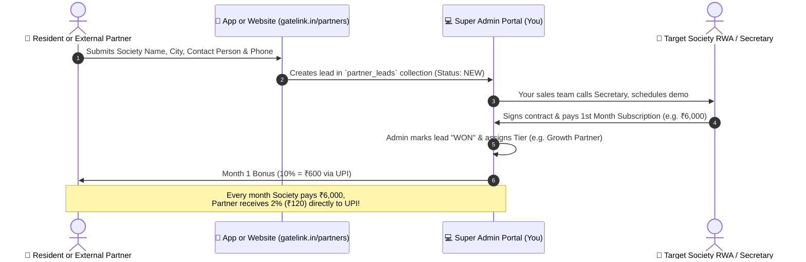

# 🚀 GateLink Partner & Referral Growth Engine — Master Strategy & Specification Document

---

## 📑 TABLE OF CONTENTS
1. [WHAT is the GateLink Partner & Referral Program?](#1-what-is-the-gatelink-partner--referral-program)
2. [WHY We Are Doing This (The Business Strategy & Unit Economics)](#2-why-we-are-doing-this-the-business-strategy--unit-economics)
3. [WHO Can Participate? (Internal Residents vs. External Partners)](#3-who-can-participate-internal-residents-vs-external-partners)
4. [🏆 THE 3 PARTNER TIERS & REVENUE SHARE MODEL](#4-the-3-partner-tiers--revenue-share-model)
5. [HOW IT WORKS (End-to-End Workflow & Architecture)](#5-how-it-works-end-to-end-workflow--architecture)
6. [💰 REAL-WORLD FINANCIAL EXAMPLES & MARGINS](#6-real-world-financial-examples--margins)
7. [🛡️ BUSINESS SAFETY & ANTI-FRAUD GUARDRAILS](#7-business-safety--anti-fraud-guardrails)
8. [🗺️ WHERE IT LIVES IN THE CODEBASE (Implementation Map)](#8-where-it-lives-in-the-codebase-implementation-map)
9. [🗄️ FIRESTORE DATABASE SCHEMA](#9-firestore-database-schema)
10. [🏁 3-PHASE EXECUTION ROADMAP](#10-3-phase-execution-roadmap)

---

## 1. WHAT is the GateLink Partner & Referral Program?

The **GateLink Partner & Referral Program** is a dual-channel growth engine that turns:
1. **Existing Apartment Residents & Owners**
2. **External Property Brokers, Freelancers, Independent Individuals & Security Agencies**

...into an active, commission-incentivized acquisition force that introduces and onboards new residential apartment societies to GateLink.

Instead of paying high fixed salaries to field sales agents, GateLink shares a **small percentage of net recurring software revenue (2% - 10%)** only *after* a society is onboarded and paying.

---

## 2. WHY We Are Doing This (The Business Strategy & Unit Economics)

```
┌──────────────────────────────────────────────────────────────────────────────┐
│                   TRADITIONAL SALES VS. GATELINK PARTNER ENGINE              │
├────────────────────────────────┬─────────────────────────────────────────────┤
│ Metric                         │ Traditional Field Sales │ GateLink Partner  │
├────────────────────────────────┼─────────────────────────┼───────────────────┤
│ Customer Acquisition Cost (CAC)│ ₹18,000 – ₹25,000       │ ₹500 – ₹2,500     │
│ Upfront Financial Risk         │ HIGH (Fixed salaries)   │ ZERO (Pay on win) │
│ Gross SaaS Margin Retained     │ ~70% (High overheads)   │ 90% – 98%         │
│ Society Churn Protection       │ Weak                    │ MAXIMUM (Partner) │
│ Scalability across cities      │ Slow & expensive        │ Fast & viral      │
└────────────────────────────────┴─────────────────────────┴───────────────────┘
```

### Key Strategic Benefits:
* **Zero Upfront Risk**: You never pay a single rupee until real subscription money is credited to your bank account.
* **Sticky Anti-Churn Guard**: Because Growth Partners earn 2% recurring monthly revenue as long as their referred society stays active, **they will actively prevent the society from switching to competitors (MyGate, NoBrokerHood)**.
* **Hyper-Local Scalability**: 10 active property brokers in a city can easily bring **30 to 50 residential societies** within 90 days.

---

## 3. WHO Can Participate? (Two Main Audiences)

```
                              ┌─────────────────────────────────────────┐
                              │       GateLink Referral Audience        │
                              └────────────────────┬────────────────────┘
                                                   │
                ┌──────────────────────────────────┴──────────────────────────────────┐
                ▼                                                                     ▼
    ┌───────────────────────┐                                             ┌───────────────────────┐
    │ AUDIENCE A: Residents │                                             │ AUDIENCE B: External  │
    │  (Living in a flat)   │                                             │ (Brokers/Freelancers) │
    └───────────┬───────────┘                                             └───────────┬───────────┘
                │                                                                     │
• Access inside Resident Mobile App                                     • Sign up via `gatelink.in/partners`
• Under Profile → "Refer & Earn"                                        • Live in independent houses/different areas
• Earns Cash / Maintenance credits                                      • Direct UPI/Bank monthly payouts
```

---

## 4. 🏆 THE 3 PARTNER TIERS & REVENUE SHARE MODEL

```
┌─────────────────────────────────────────────────────────────────────────────┐
│ 🟢 TIER 1: Referral Partner (Casual Lead)                                   │
│ • Eligibility: Anyone who submits a society lead (Name + Secretary Phone). │
│ • Month 1 Payout: 5% of Net SaaS Subscription Fee                          │
│ • Recurring Share: 2% Monthly for 12 Months (1 Year)                        │
├─────────────────────────────────────────────────────────────────────────────┤
│ 🔵 TIER 2: Onboarding Partner (Lead + Helps Onboard Data)                   │
│ • Eligibility: Submits lead AND assists with tower/flat lists & committee. │
│ • Month 1 Payout: 10% of Net SaaS Subscription Fee                         │
│ • Recurring Share: 2% Monthly for 24 Months (2 Full Years)                 │
├─────────────────────────────────────────────────────────────────────────────┤
│ 🟣 TIER 3: Growth Partner (Pro Brokers / Multi-Society Promoters)          │
│ • Eligibility: Brings ≥ 3 active societies OR signed partner vendor.       │
│ • Month 1 Payout: 10% of Net SaaS Subscription Fee                         │
│ • Recurring Share: 2% LIFETIME (as long as society is active on GateLink)   │
└─────────────────────────────────────────────────────────────────────────────┘
```

---

## 5. HOW IT WORKS (End-to-End Workflow & Architecture)



---

## 6. 💰 REAL-WORLD FINANCIAL EXAMPLES & MARGINS

### Scenario A: Moderate Society (150 Flats @ ₹25/flat/mo = ₹3,750/mo)

| Period | Partner Gets (2%) | GateLink Keeps (98%) |
| :--- | :--- | :--- |
| **Month 1 (10% Bonus)** | **₹375** | **₹3,375** |
| **Months 2 – 12 (2%/mo)**| **₹75 / month** (₹825 total) | **₹3,675 / month** (₹40,425 total) |
| **Year 1 Total** | **₹1,200** | **₹43,800 PURE REVENUE** |

---

### Scenario B: Pro Broker / Growth Partner with 10 Societies (Total 2,000 Flats)
* **Total Monthly Billing Collected by GateLink**: **₹50,000 / month** (₹6,00,000 / year).
* **Partner's 2% Lifetime Share**: **₹1,000 / month** (₹12,000 / year).
* **GateLink Retains**: **₹49,000 / month (₹5,88,000 / year)**!

---

## 7. 🛡️ BUSINESS SAFETY & ANTI-FRAUD GUARDRAILS

```
┌─────────────────────────────────────────────────────────────────────────────┐
│ 1. NET REVENUE ONLY                                                         │
│    All percentages (5%, 10%, 2%) apply strictly to Net GateLink SaaS        │
│    Subscription Revenue — EXCLUDING 18% GST taxes, hardware costs (boom     │
│    barriers, RFID cards), and payment gateway fees (Cashfree/Razorpay).     │
│                                                                             │
│ 2. REQUISITE MINIMUM SOCIETY SIZE                                           │
│    Referred societies must have at least 40 flats to qualify for payout.    │
│                                                                             │
│ 3. ACTIVE SOCIETY / NO-CHURN CLAUSE                                         │
│    "Lifetime" is defined as the active paying lifespan of the society on   │
│    GateLink. If a society cancels, defaults, or leaves, revenue share stops │
│    immediately with zero liability.                                         │
│                                                                             │
│ 4. MANUAL SUPER ADMIN APPROVAL                                              │
│    Payouts are never disbursed automatically by a robot. Super Admin        │
│    reviews the invoice clearance and clicks "Approve Payout".               │
└─────────────────────────────────────────────────────────────────────────────┘
```

---

## 8. 🗺️ WHERE IT LIVES IN THE CODEBASE (Implementation Map)

```
SocietySphere / GateLink
├── 📱 resident_app/
│   └── lib/features/referral/
│       ├── presentation/screens/referral_screen.dart     # Resident Lead Form + WhatsApp Share
│       ├── presentation/widgets/partner_tier_cards.dart  # Visual 3-Tier explanation
│       └── data/repositories/referral_repository_impl.dart
│
├── 💻 website/
│   └── src/pages/partners/
│       └── PartnersPage.jsx                              # Public gatelink.in/partners Landing Page
│
├── 👑 super_admin/
│   └── src/features/referrals/
│       ├── pages/PartnerLeadsPage.jsx                    # Super Admin CRM Pipeline
│       └── components/PayoutApprovalModal.jsx            # Monthly Payout Approval
│
└── ☁️ Backend (Firestore Collections)
    ├── partner_leads/                                    # All incoming society leads
    ├── partner_accounts/                                 # Partner profiles & UPI details
    └── partner_payouts/                                  # Completed monthly commission logs
```

---

## 9. 🗄️ FIRESTORE DATABASE SCHEMA

```typescript
// Collection: partner_leads/{leadId}
{
  leadId: "LEAD-2026-901",
  referrerType: "resident" | "external_partner",
  referrerUserId: "USER-FAISAL-01",
  referrerName: "Faisal Hasan",
  referrerPhone: "+919568741236",
  referrerUpiId: "faisal@okhdfcbank",
  
  // Target Society Details
  societyName: "Royal Palm Meadows",
  city: "Farooqnagar",
  contactPersonName: "Mr. K. Sharma",
  contactPersonRole: "RWA Secretary",
  contactPhone: "+919845011223",
  approxFlats: 180,
  
  // Sales Pipeline
  status: "demo_scheduled", // "new" | "contacted" | "demo_scheduled" | "won" | "lost"
  assignedTier: "growth_partner", // "referral" | "onboarding" | "growth_partner"
  
  // Financial Tracking
  monthlyFee: 4500,
  month1BonusPaid: false,
  recurringCommissionActive: false,
  createdAt: "2026-08-17T12:00:00.000Z"
}
```

---

## 10. 🏁 3-PHASE EXECUTION ROADMAP

| Phase | Component | Deliverable |
| :--- | :--- | :--- |
| **Phase 1** | **Resident Mobile App** | Build `ReferralScreen` with WhatsApp Sharing, 3-Tier summary, and Society Lead Form. |
| **Phase 2** | **Public Website** | Build `gatelink.in/partners` landing page for external brokers and freelancers. |
| **Phase 3** | **Super Admin CRM** | Build `PartnerLeadsPage.jsx` to review incoming leads, change stages (*New $\rightarrow$ Demo $\rightarrow$ Won*), and approve UPI payouts. |
