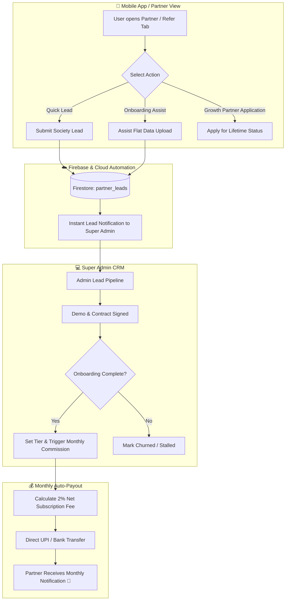

# 🚀 GateLink Partner & Referral Revenue Share Blueprint

---

## 🌟 1. Executive Summary & Business Economics

In traditional B2B PropTech SaaS, acquiring an apartment complex or gated community through cold sales teams costs **₹15,000 – ₹25,000 per society** (salaries, travel, field reps).

By introducing the **GateLink Tiered Partner & Revenue Share Model**, you turn residents, property brokers, facility managers, and security agencies into an incentivized, self-funding acquisition engine:

```
┌──────────────────────────────────────────────────────────────────────────────┐
│                            FINANCIAL IMPACT & ROI                            │
├────────────────────────────────┬─────────────────────────────────────────────┤
│ Traditional Sales Cost         │ ₹18,000 per society (Sales reps, travel)    │
│ GateLink Partner Payout        │ 5% – 10% Month 1 + 2% Recurring Revenue     │
├────────────────────────────────┼─────────────────────────────────────────────┤
│ 💰 YOUR NET MARGIN RETAINED    │ 90% – 98% of all Recurring SaaS Revenue     │
│ 🛡️ ANTI-CHURN INCENTIVE        │ Partners protect your retention long-term   │
│ 📈 RECURRING ANNUAL REVENUE    │ ₹24,000 – ₹1,20,000 / year per society      │
│ 🎯 RETURN ON INVESTMENT (ROI)  │ Over 1000% within Year 1                    │
└────────────────────────────────┴─────────────────────────────────────────────┘
```

---

## 🏆 2. The 3 Partner Tiers (Revenue Share Model)

```
┌─────────────────────────────────────────────────────────────────────────────┐
│                         GATELINK PARTNER TIERS                              │
├──────────────────────────┬──────────────────────┬───────────────────────────┤
│ Tier                     │ Month 1 Payout       │ Recurring Revenue Share   │
├──────────────────────────┼──────────────────────┼───────────────────────────┤
│ 🟢 Referral Partner      │ 5% of Net Billing    │ 2% for 12 Months          │
│ 🔵 Onboarding Partner    │ 10% of Net Billing   │ 2% for 24 Months          │
│ 🟣 Growth Partner        │ 10% of Net Billing   │ 2% LIFETIME (Active Soc.) │
└──────────────────────────┴──────────────────────┴───────────────────────────┘
```

---

### 🟢 Tier 1: Referral Partner (Intro Only)
* **Who it is for**: Casual residents, tenants, or friends who simply share a phone number or introduce the society committee.
* **Their Effort**: Zero follow-up; they only introduce the lead.
* **Payout**:
  * **Month 1**: **5%** of the first month's SaaS subscription.
  * **Months 2 – 12**: **2%** recurring monthly revenue share for 1 year.
* **Total 1-Year Earnings (100-flat society @ ₹2,500/mo)**: ₹125 + (11 × ₹50) = **₹675**.

---

### 🔵 Tier 2: Onboarding Partner (Intro + Onboarding Support)
* **Who it is for**: Proactive residents, society tech champions, or local consultants who introduce the society **and** assist in collecting resident flat numbers, tower rosters, and guard training.
* **Their Effort**: Introduces + helps your team onboard the residents smoothly.
* **Payout**:
  * **Month 1**: **10%** of the first month's SaaS subscription.
  * **Months 2 – 24**: **2%** recurring monthly revenue share for **2 Full Years (24 months)**.
* **Total 2-Year Earnings (200-flat society @ ₹5,000/mo)**: ₹500 + (23 × ₹100) = **₹2,800**.

---

### 🟣 Tier 3: Growth Partner (Active Acquisition & Retention)
* **Who it is for**: Real estate brokers, property managers, security guard agency owners, and super-active community ambassadors who consistently bring new gated communities.
* **Their Effort**: Actively sources societies, closes deals, and maintains a direct relationship with society committees.
* **Payout**:
  * **Month 1**: **10%** of the first month's SaaS subscription.
  * **Ongoing**: **2% LIFETIME RECURRING** (as long as the society remains active on GateLink).
* **Lifetime Earning Power**:
  * If a Growth Partner manages **10 societies** (avg. 200 flats each = ₹50,000/month billing):
  * They receive a **passive ₹1,000 / month (₹12,000 / year)** every single year with zero maintenance overhead!

---

## 📊 3. Complete System Architecture & Lifecycle



---

## 🛡️ 4. Business Safety Rules (Protecting Your Profit & Cash Flow)

To ensure this model is 100% safe and profitable for GateLink, the following rules apply:

```
┌─────────────────────────────────────────────────────────────────────────────┐
│                       PARTNER SAFETY CONDITIONS                             │
├─────────────────────────────────────────────────────────────────────────────┤
│ 1. NET REVENUE BASIS                                                        │
│    All percentages (5%, 10%, 2%) are calculated on Net GateLink SaaS        │
│    Subscription Fees — strictly EXCLUDING 18% GST government taxes,         │
│    hardware costs (RFID tags, boom barrier devices), and payment gateway    │
│    processing fees (Cashfree/Razorpay).                                     │
│                                                                             │
│ 2. MINIMUM THRESHOLD FOR LIFETIME TIER                                      │
│    To unlock 🟣 Growth Partner (Lifetime 2%), a partner must onboard a     │
│    minimum of 3 active societies OR have a signed B2B partner contract.     │
│                                                                             │
│ 3. ACTIVE SOCIETY / NO-CHURN RULE                                           │
│    "Lifetime" is defined as the active paying lifespan of the society on    │
│    GateLink. If a society cancels, defaults, or leaves the platform, the    │
│    revenue share automatically stops immediately with zero liability.       │
│                                                                             │
│ 4. DEDUPLICATION                                                            │
│    If multiple people refer the same society, the earliest timestamped      │
│    lead verified by the committee receives the commission.                  │
└─────────────────────────────────────────────────────────────────────────────┘
```

---

## 📱 5. In-App Partner UI & Wireframe

```
┌────────────────────────────────────────────────────────┐
│  ←  Partner & Earn Rewards                            🔔│
├────────────────────────────────────────────────────────┤
│                                                        │
│   🚀 GATELINK REVENUE SHARE PROGRAM                    │
│   Earn recurring passive income by onboarding          │
│   residential societies to GateLink.                   │
│                                                        │
│   ┌────────────────────────────────────────────────┐   │
│   │ Lifetime Earnings: ₹14,200  Active Soc: 3      │   │
│   │ Current Tier: 🟣 Growth Partner (Lifetime 2%)  │   │
│   └────────────────────────────────────────────────┘   │
│                                                        │
│  ─────────── [ 🌟 YOUR PARTNER TIERS ] ────────────────│
│                                                        │
│   🟢 Referral Partner   : 5% M1  + 2% (12 Months)      │
│   🔵 Onboarding Partner : 10% M1 + 2% (24 Months)      │
│   🟣 Growth Partner     : 10% M1 + 2% LIFETIME         │
│                                                        │
│  ─────────── [ 🏢 SUBMIT A NEW SOCIETY ] ──────────────│
│                                                        │
│   Society Name : [ Royal Palm Meadows                ] │
│   City         : [ Hyderabad / Farooqnagar           ] │
│   Contact Name : [ Mr. K. Sharma (RWA Secretary)     ] │
│   Phone Number : [ +91 98450 11223                   ] │
│   Approx Flats : [ 180 Flats                         ] │
│                                                        │
│   [ 🚀 Submit Society Lead ]                           │
│                                                        │
│  ─────────── [ 📋 MY ACTIVE REVENUE STREAMS ] ─────────│
│                                                        │
│   • Green Valley Heights (150 Flats)                   │
│     Tier: 🟣 Growth Partner   Monthly Pay: ₹150 / mo   │
│     Status: 🟢 Active (14 months paid)                 │
│                                                        │
│   • Cyber Towers Residency (300 Flats)                 │
│     Tier: 🔵 Onboarding       Monthly Pay: ₹300 / mo   │
│     Status: 🟢 Active (Month 4 of 24)                  │
│                                                        │
└────────────────────────────────────────────────────────┘
```

---

## 🗄️ 6. Firestore Data Model for Tiered Partnerships

```typescript
// Collection: partner_accounts/{partnerId}
{
  partnerId: "PRT-FAISAL-01",
  userId: "USER-FAISAL-001",
  name: "Faisal Hasan",
  phone: "+919568741236",
  email: "faisal@example.com",
  currentTier: "growth_partner", // "referral" | "onboarding" | "growth_partner"
  totalLifetimeEarnings: 14200,
  activeSocietiesCount: 3,
  payoutUpiId: "faisal@okhdfcbank",
  payoutMethod: "UPI",
  createdAt: "2026-08-17T10:00:00.000Z"
}

// Collection: partner_societies/{partnerSocietyId}
{
  partnerSocietyId: "PS-001",
  partnerId: "PRT-FAISAL-01",
  societyId: "SOC-GREENVALLEY",
  societyName: "Green Valley Heights",
  tier: "growth_partner",
  month1Rate: 0.10,        // 10%
  recurringRate: 0.02,     // 2%
  maxMonths: null,         // null for Lifetime, 12 or 24 for fixed tiers
  monthsPaid: 14,
  monthlyBillingAmount: 7500,
  currentMonthlyShare: 150,
  status: "active",        // "active" | "paused" | "churned"
  onboardedAt: "2025-06-01T00:00:00.000Z"
}
```

---

## 🏁 7. Rollout Plan in 3 Phases

1. **Phase 1 (Documentation & Terms)**: Include these clear partner terms on `https://gatelink.in/partners` and in the app.
2. **Phase 2 (In-App Lead Submission)**: Add the `"Partner & Earn"` menu in the Resident App for 1-tap society lead submission.
3. **Phase 3 (Super Admin Commission CRM)**: Super Admin dashboard calculates monthly commissions and displays monthly partner payouts.
