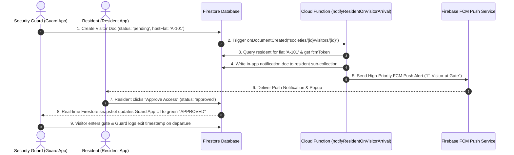

# 05. Core End-to-End Workflows

## Workflow 1: Walk-In Visitor Check-In & Real-Time Resident Approval

---

## Workflow 2: Resident Self-Registration & Mandatory RWA Approval

1. **Registration Request**: Resident opens `HomeHni Residency` app, enters Name, Email, Password, Flat Number, and official Society Code (e.g. `SOC-001`).
2. **Society Code Check**: `AuthService.registerWithEmail` queries `societies` collection where `code == 'SOC-001'`. Rejects if invalid.
3. **Pending Account Creation**: Creates Firebase Auth user and writes profile document to `societies/SOC-001/users/{uid}` with `status: 'pending_approval'`. Also populates `/users/{uid}` index.
4. **App Enclosure**: Mobile `app_router.dart` detects `status == 'pending_approval'` and locks user on `PendingApprovalScreen`.
5. **RWA Admin Review**: Society Admin opens `/residents` in Society Admin Panel, views residency proof document, and clicks **Approve Access**.
6. **Account Unlock**: Admin updates Firestore status to `'active'`. Mobile app detects live status change and redirects resident to `/home` dashboard.

---

## Workflow 3: Inbound SaaS Website Lead Capture & Super Admin CRM

1. **Lead Submission**: Prospective client submits demo request on public website form (`HeroSection` / `DemoModal`).
2. **Firestore Write**: Writes document to `/leads` collection with `name`, `email`, `phone`, `societyName`, `flatCount`.
3. **Super Admin CRM Sync**: `SuperAdminDashboard` and `CrmLeads` listen to real-time `leads` query.
4. **Pipeline Tracking**: Super Admin updates lead status through stages (`New` ➔ `Contacted` ➔ `Demo Scheduled` ➔ `Proposal Sent` ➔ `Closed Won`).
