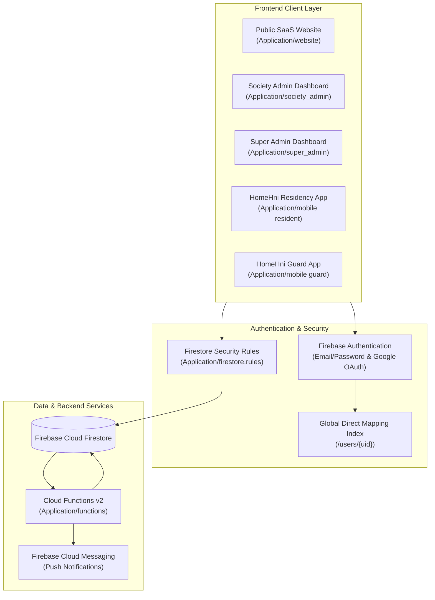

# 16. Complete System Architecture & High-Level Blueprint

## 1. High-Level Architecture Flow

---

## 2. Component Integration Matrix

- **Public Website (`Application/website`)**: Submits lead documents directly to `/leads` collection in Firestore.
- **Society Admin Panel (`Application/society_admin`)**: Reads and writes to `societies/{societyId}/*` collections. Uses `getSocietyAdminSession` and Firebase Auth token state.
- **Super Admin Panel (`Application/super_admin`)**: Accesses executive collections `/leads`, `/societies`, `/ad_campaigns`.
- **Resident Mobile App (`Application/mobile` - Resident)**: Uses `auth_service.dart` for self-registration, reads `userProfileProvider` via `/users/{uid}` mapping index, listens to `societies/{societyId}/visitors` and `notifications`.
- **Guard Security App (`Application/mobile` - Guard)**: Performs walk-in visitor entry on `societies/{societyId}/visitors`, scans QR codes, and logs vehicle entries.
- **Cloud Functions (`Application/functions`)**: Triggers on `visitors`, `amenity_bookings`, `maintenance_bills`, and `complaints` updates to send in-app and FCM push notifications.
