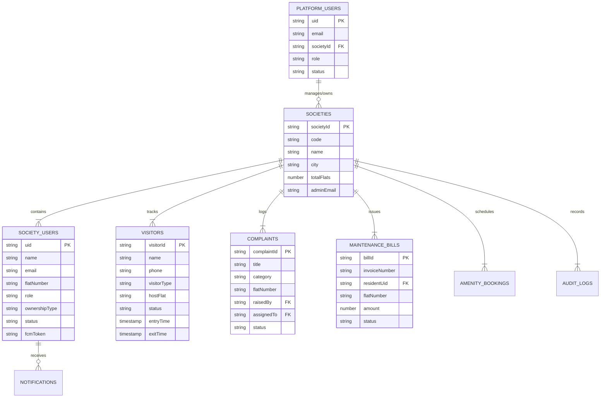

# 19. Database Entity-Relationship Diagram (ERD)

```mermaid
erDiagram
    PLATFORM_USERS ||--o{ SOCIETIES : "manages/owns"
    SOCIETIES ||--|{ SOCIETY_USERS : "contains"
    SOCIETIES ||--|{ VISITORS : "tracks"
    SOCIETIES ||--|{ COMPLAINTS : "logs"
    SOCIETIES ||--|{ MAINTENANCE_BILLS : "issues"
    SOCIETIES ||--|{ AMENITY_BOOKINGS : "schedules"
    SOCIETIES ||--|{ AUDIT_LOGS : "records"
    SOCIETY_USERS ||--o{ NOTIFICATIONS : "receives"

    PLATFORM_USERS {
        string uid PK
        string email
        string societyId FK
        string role
        string status
    }

    SOCIETIES {
        string societyId PK
        string code
        string name
        string city
        number totalFlats
        string adminEmail
    }

    SOCIETY_USERS {
        string uid PK
        string name
        string email
        string flatNumber
        string role
        string ownershipType
        string status
        string fcmToken
    }

    VISITORS {
        string visitorId PK
        string name
        string phone
        string visitorType
        string hostFlat
        string status
        timestamp entryTime
        timestamp exitTime
    }

    COMPLAINTS {
        string complaintId PK
        string title
        string category
        string flatNumber
        string raisedBy FK
        string assignedTo FK
        string status
    }

    MAINTENANCE_BILLS {
        string billId PK
        string invoiceNumber
        string residentUid FK
        string flatNumber
        number amount
        string status
    }
```
