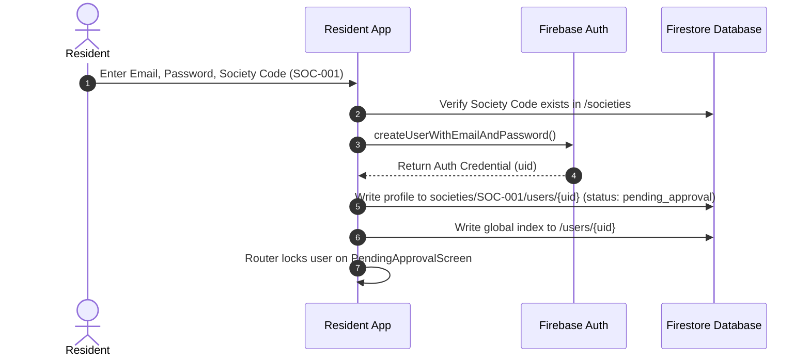

# 21. Authentication Architecture & Identity Flows

## Authentication Flow Diagrams

### Resident Mobile Sign-In & Onboarding

---

### Society Admin Login Flow

1. Admin submits credentials on `/login` page of Society Admin Panel.
2. Web app authenticates user with Firebase Auth (`signInWithEmailAndPassword`).
3. Queries `societies` collection where `adminEmail == user.email` to resolve matching `societyId`.
4. Saves `societyId` in `sessionManager.js` and initializes dashboard views.
