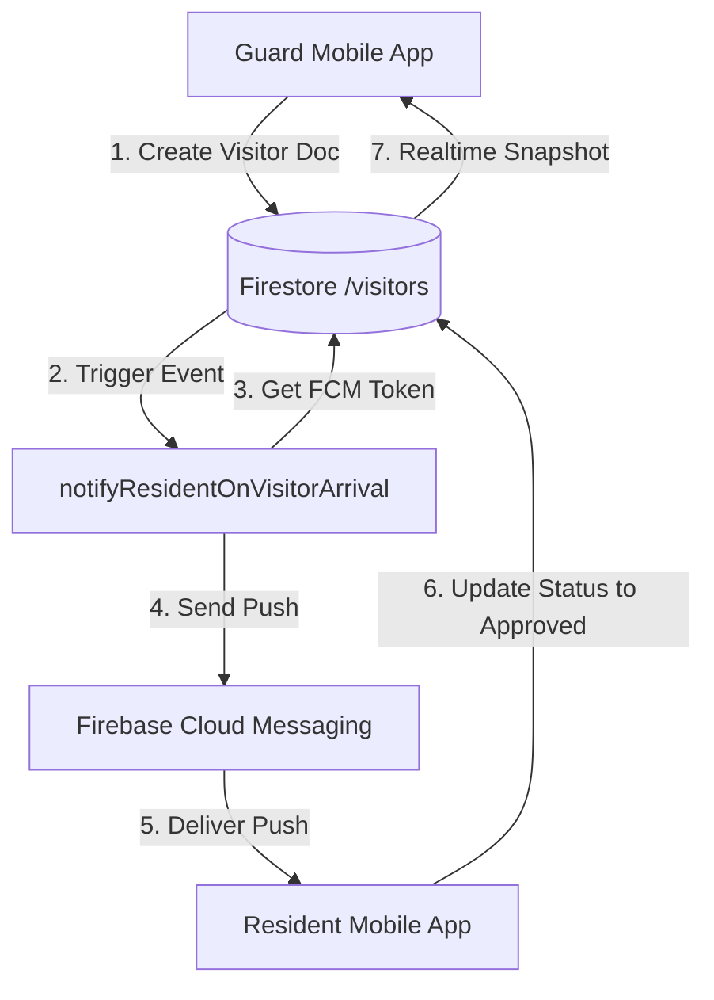
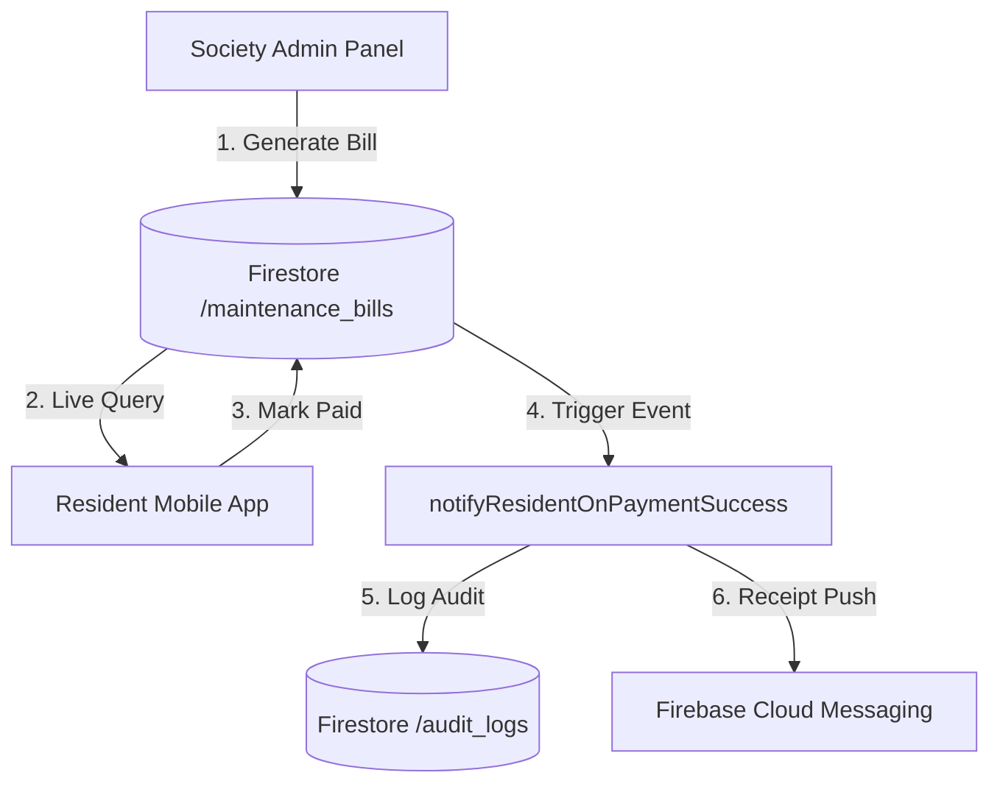

# 23. Complete Data Flow Diagrams (DFDs)

## 1. Visitor Arrival & Approval DFD

```mermaid
flowchart TD
    GuardApp[Guard Mobile App] -->|1. Create Visitor Doc| FS[(Firestore /visitors)]
    FS -->|2. Trigger Event| CloudFunc[notifyResidentOnVisitorArrival]
    CloudFunc -->|3. Get FCM Token| FS
    CloudFunc -->|4. Send Push| FCM[Firebase Cloud Messaging]
    FCM -->|5. Deliver Push| ResApp[Resident Mobile App]
    ResApp -->|6. Update Status to Approved| FS
    FS -->|7. Realtime Snapshot| GuardApp
```

---

## 2. Maintenance Billing & Payment DFD

```mermaid
flowchart TD
    AdminPanel[Society Admin Panel] -->|1. Generate Bill| FS[(Firestore /maintenance_bills)]
    FS -->|2. Live Query| ResApp[Resident Mobile App]
    ResApp -->|3. Mark Paid| FS
    FS -->|4. Trigger Event| CloudFunc[notifyResidentOnPaymentSuccess]
    CloudFunc -->|5. Log Audit| Audit[(Firestore /audit_logs)]
    CloudFunc -->|6. Receipt Push| FCM[Firebase Cloud Messaging]
```
