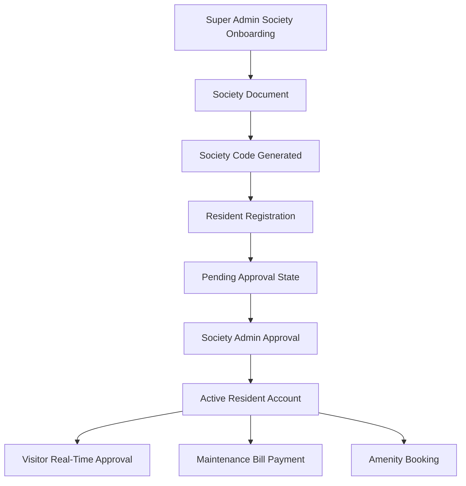

# 24. Feature Dependency Graph

```mermaid
flowchart TD
    SuperAdminOnboarding[Super Admin Society Onboarding] --> SocietyDoc[Society Document]
    SocietyDoc --> SocietyCode[Society Code Generated]
    SocietyCode --> ResidentRegistration[Resident Registration]
    ResidentRegistration --> PendingApproval[Pending Approval State]
    PendingApproval --> AdminApproval[Society Admin Approval]
    AdminApproval --> ActiveResident[Active Resident Account]
    ActiveResident --> VisitorApproval[Visitor Real-Time Approval]
    ActiveResident --> MaintenancePayment[Maintenance Bill Payment]
    ActiveResident --> AmenityBooking[Amenity Booking]
```
