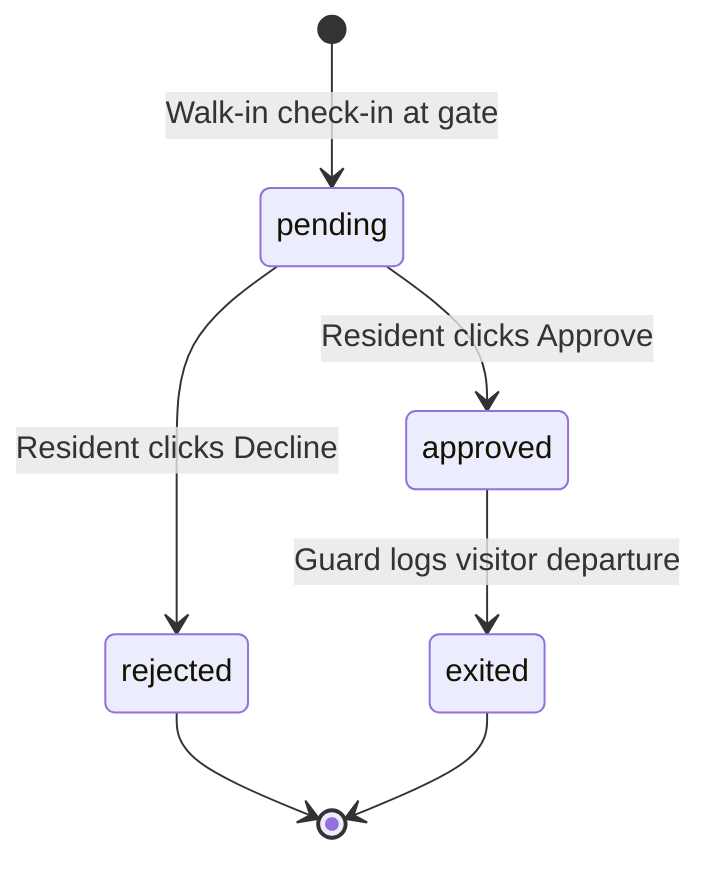
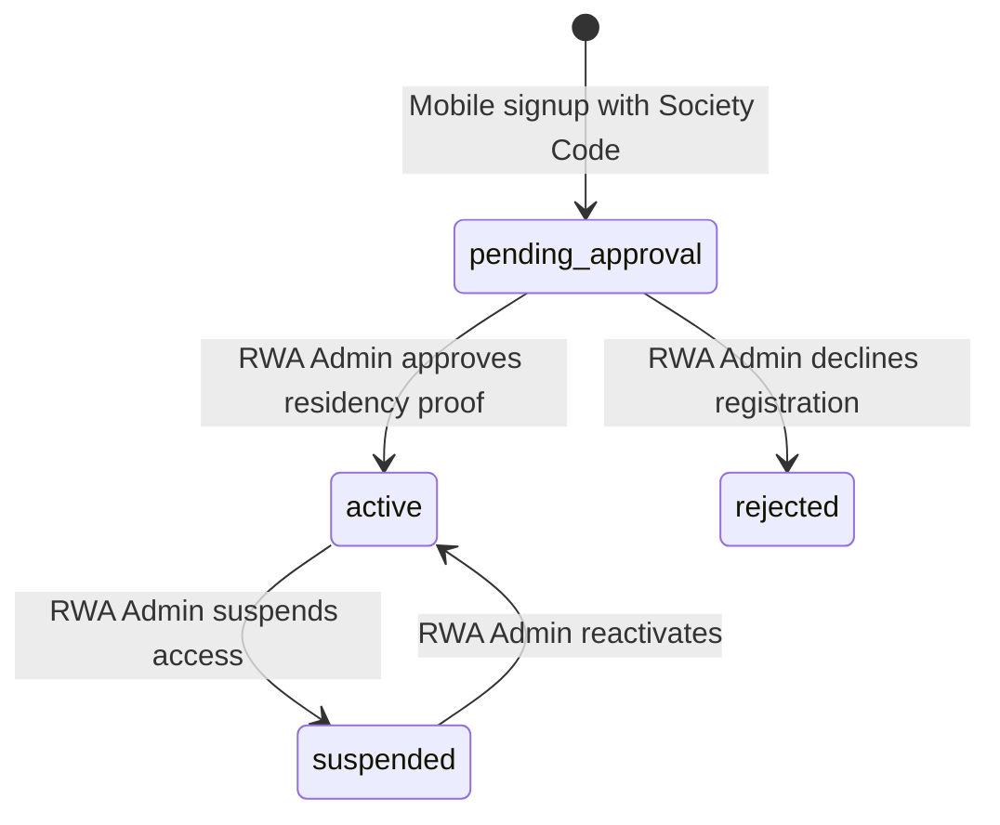
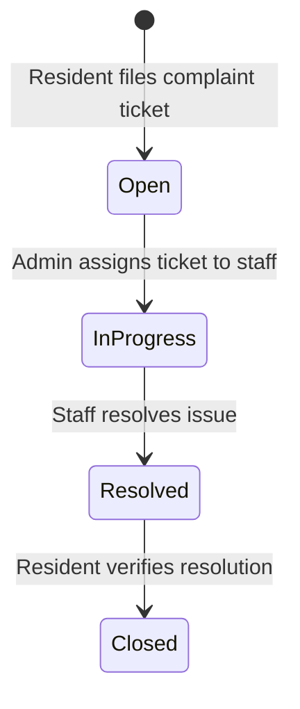

# 26. Domain State Machines

## 1. Visitor State Machine

```mermaid
stateDiagram-v2
    [*] --> pending: Walk-in check-in at gate
    pending --> approved: Resident clicks Approve
    pending --> rejected: Resident clicks Decline
    approved --> exited: Guard logs visitor departure
    rejected --> [*]
    exited --> [*]
```

---

## 2. Resident Account State Machine

```mermaid
stateDiagram-v2
    [*] --> pending_approval: Mobile signup with Society Code
    pending_approval --> active: RWA Admin approves residency proof
    pending_approval --> rejected: RWA Admin declines registration
    active --> suspended: RWA Admin suspends access
    suspended --> active: RWA Admin reactivates
```

---

## 3. Helpdesk Complaint State Machine

```mermaid
stateDiagram-v2
    [*] --> Open: Resident files complaint ticket
    Open --> InProgress: Admin assigns ticket to staff
    InProgress --> Resolved: Staff resolves issue
    Resolved --> Closed: Resident verifies resolution
```
